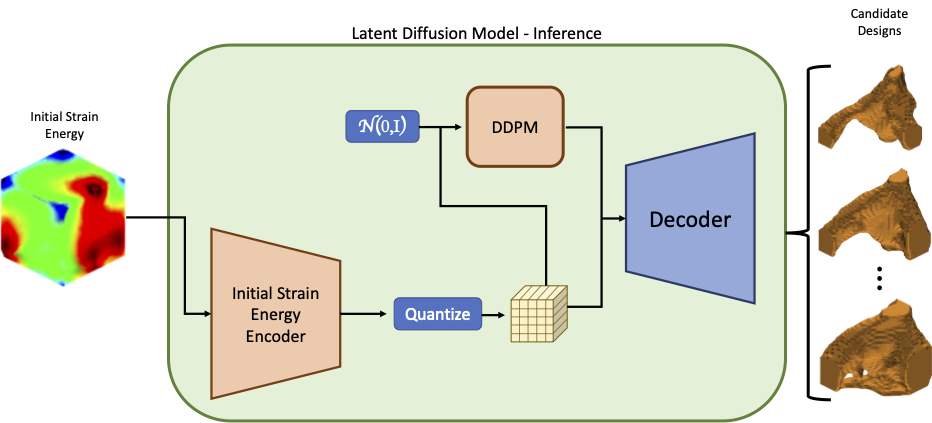

# Latent Diffusion Models for Structural Component Design



This repository contains an implementation of a latent diffusion model for generating structural components. The model consists of two main parts:

1. A multi-headed variational autoencoder (VAE) that learns a compressed latent representation of SIMP-optimized designs and respective initial strain energies
2. A diffusion transformer (DiT) that generates new design latents conditioned on the initial strain energy latents

## Repository Structure

The main components can be found in `src/`:

- `models/`
  - `autoencoders.py`: Contains the `MultiHeadedVariationalAutoencoder` class which compresses initial strain energies and structural components into a latent space using both discrete (VQ) and continuous (Gaussian) latent variables, respectively
  - `dit.py`: Implementation of the Diffusion Transformer model that generates new components in the latent space
- `trainers/`
  - `multiheaded_vae.py`: Training loop for the Multi-Headed VAE
  - `latent_diffusion.py`: Training loop for the Latent Diffusion Model
- `main.py`: Entry point for training both models

## Usage

The models can be trained using the following commands:

Train the VAE:
```bash
python main.py vae --data_path /path/to/data --num_steps 10000
```

Train the LDM (after training VAE):
```bash
python main.py ldm --data_path /path/to/data --vae_weights_path /path/to/vae/weights --num_steps 10000
```

## Citation

Read our paper: [arXiv](https://arxiv.org/pdf/2309.11601) | [CAD](https://www.sciencedirect.com/science/article/abs/pii/S0010448524000344)

```bibtex
@article{herron2024latent,
  title={Latent diffusion models for structural component design},
  author={Herron, Ethan and Rade, Jaydeep and Jignasu, Anushrut and Ganapathysubramanian, Baskar and Balu, Aditya and Sarkar, Soumik and Krishnamurthy, Adarsh},
  journal={Computer-Aided Design},
  volume={171},
  pages={103707},
  year={2024},
  publisher={Elsevier}
}
```

*This README was written by Claude, an AI assistant.*